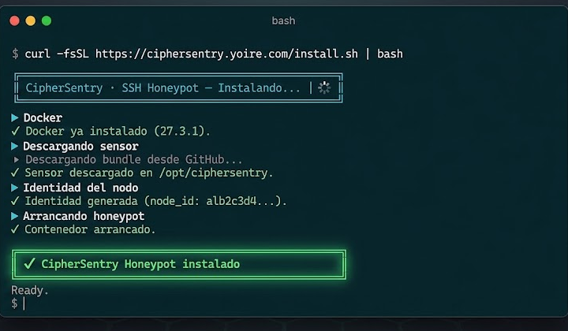
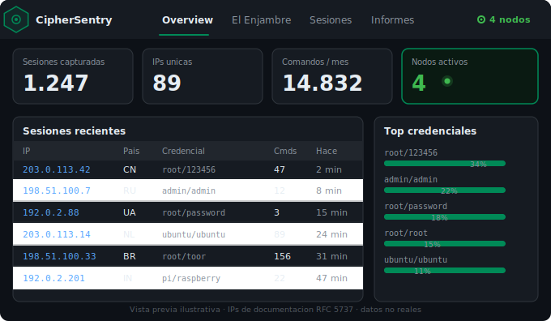

# CipherSentry SSH Honeypot

**Convierte cada ataque en inteligencia.**

Honeypot SSH de código abierto que convierte conexiones de atacantes en inteligencia accionable: captura credenciales, sesiones y payloads, y los hace creíbles delegando la emulación en la **CipherSentry Shell API**.

> Este repositorio es el sensor cliente (MIT). El engine de emulación (70+ comandos, VFS Debian 12, pipelines, REPLs) vive en la Shell API — no está incluido aquí.

---

## El Enjambre — red de sensores distribuidos


Instala el sensor en cualquier servidor o VPS con un comando. Puedes desplegar tantos nodos como quieras — todos quedan visibles y gestionables desde el mismo dashboard. La inteligencia se agrega automáticamente: cuantos más nodos, más señal.

---

## Despliegue rápido



```bash
curl -fsSL https://ciphersentry.yoire.com/install.sh | bash
```

### Opciones del instalador

| Opción | Descripción | Default |
|--------|-------------|---------|
| `--key <api_key>` | Vincula el nodo a tu cuenta desde el primer momento | *modo anónimo* |
| `--dir <ruta>` | Directorio de instalación | `/opt/ciphersentry` |
| `--port <num>` | Puerto SSH del honeypot | 22 si libre, si no 2222 |
| `--no-docker` | Omite la instalación de Docker (ya lo tienes) | — |

Ejemplos habituales:

```bash
# Con cuenta vinculada
curl -fsSL https://ciphersentry.yoire.com/install.sh | bash -s -- --key <tu-key>

# Docker ya instalado, directorio personalizado
curl -fsSL https://ciphersentry.yoire.com/install.sh | bash -s -- \
  --dir /opt/ciphersentry \
  --no-docker

# Puerto específico (p. ej. en un servidor con SSH real en el 22)
curl -fsSL https://ciphersentry.yoire.com/install.sh | bash -s -- --port 2222
```

**Funciona desde el minuto cero:** el sensor viene preconfigurado con la Shell API de CipherSentry.

**Vincular el nodo a tu cuenta:**

```bash
bash node.sh enroll     # imprime tu código (p. ej. NODO-A1B2-C3D4-E5F6)
# → El Enjambre → Añadir nodo → pega el código
```

A partir de ahí, todas tus capturas aparecen en tu cuenta.

---

## Gestión del nodo

Desde el directorio de instalación (`/opt/ciphersentry` por defecto):

| Comando | Acción |
|---------|--------|
| `bash node.sh` | Estado: puerto, sesiones capturadas, Shell API alcanzable |
| `bash node.sh up` | Arrancar el honeypot |
| `bash node.sh down` | Parar el honeypot |
| `bash node.sh logs` | Actividad en tiempo real |
| `bash node.sh enroll` | Código para vincular este nodo a tu cuenta |
| `bash node.sh test` | Probar la conexión a la Shell API |
| `bash node.sh update` | Actualizar a la última versión y reconstruir |

---

## Actualizar la sonda

```bash
bash node.sh update
```

Descarga la **última versión publicada**, reconstruye el contenedor y **conserva tu `config.yaml`,
tu identidad de nodo y tus logs**. No hay pasos manuales.

> El estado que se imprime al terminar lo dibuja la versión anterior; **vuelve a ejecutar `bash node.sh`**
> para verlo ya con la versión nueva.


---

## Dashboard



Gestiona todos tus nodos, explora sesiones, analiza IPs y exporta inteligencia desde un único panel.

---

## Planes

|  | **Free** | **Starter** | **Pro** | **Enterprise** |
|--|----------|-------------|---------|----------------|
| **Precio** | Gratis | €19/mes | €79/mes | €499/mes |
| Sesiones de honeypot | ✓ | ✓ | ✓ | ✓ |
| Comandos emulados/mes | ✓ | ✓ | ✓ | ✓ |
| Nodos en el enjambre | ✓ | ✓ | ✓ | ✓ |
| Export de datos (RGPD) | ✓ | ✓ | ✓ | ✓ |
| Onboarding guiado | — | *próximamente* | *próximamente* | *próximamente* |
| Inteligencia: IOCs e informes | — | — | *próximamente* | *próximamente* |
| Detección de campañas | — | — | *próximamente* | *próximamente* |
| Retención extendida | — | — | *próximamente* | *próximamente* |
| Seguridad avanzada / on-prem | — | — | — | *próximamente* |
| Soberanía del dato | — | — | — | *próximamente* |

Sin tarjeta de crédito para empezar · [Ver todos los planes →](https://ciphersentry.yoire.com/planes.html)

---

## Configuración

### config.yaml

El nodo viene **preconfigurado** y funciona desde el minuto cero sin tocar nada. Para la mayoría de usos no hace falta editar este fichero — el instalador con `--key` y `node.sh enroll` cubren el resto.

```yaml
# CipherSentry Honeypot Client — configuración
host: "0.0.0.0"
port: 2222
host_key_file: "host_key"
ssh_banner: "Debian GNU/Linux 12"
ssh_version: "OpenSSH_8.4p1 Debian-5+deb11u1"
accept_any_password: true
fake_hostname: "web-srv-01"
log_dir: "logs"
verbose: false

# Ventana de captura de credenciales: durante [start_minute, end_minute) de cada
# hora se bloquean los EXEC (comandos sueltos) para registrar credencial + comando
# sin servirlos. Las sesiones SHELL interactivas se permiten SIEMPRE (son el oro).
credential_capture:
  enabled: true
  start_minute: 45   # de xx:45
  end_minute: 60     # a xx:00 (60 = en punto)

# Shell API central — preconfigurada, el nodo funciona desde el minuto cero.
# Sobrescribible con SHELL_API_URL (env o .env).
shell_api_url: "https://api.ciphersentry.yoire.com"

# URL del panel web (opcional). Si no se indica, node.sh la deriva del api_url.
# dashboard_url: "https://app.ciphersentry.yoire.com"

# Tu API key de El Enjambre. Cámbiala por la tuya para que las sesiones aparezcan
# en tu cuenta. Encuéntrala en: El Enjambre → Mi cuenta → API key.
# Sin cambiarla las sesiones se capturan igualmente pero en modo anónimo.
# Nota: "free-demo" es una clave compartida y pública — verla aquí es intencional.
shell_api_key: "free-demo"
```

### Ventana de captura de credenciales

Durante `[start_minute, end_minute)` de cada hora, el honeypot **bloquea los
comandos no interactivos (EXEC, `ssh host "cmd"`)**: registra la credencial y el
comando intentado en un evento `exec_blocked`, pero **no** lo ejecuta. Esto fuerza
a los bots a seguir probando credenciales. Las **sesiones SHELL interactivas se
permiten siempre a la primera** — son las más valiosas y nunca se bloquean.
Fuera de la ventana, los EXEC se ejecutan con normalidad.

### Variables de entorno

| Variable | Descripción | Default |
|----------|-------------|---------|
| `HONEYPOT_PORT` | Puerto SSH | `2222` |
| `SHELL_API_URL` | URL de la Shell API | `https://api.ciphersentry.yoire.com` |
| `SHELL_API_KEY` | API key para la Shell API | `free-demo` |
| `NODE_ID` | Identidad del nodo (granularidad por nodo en El Enjambre) | `node_identity/id` |
| `HONEYPOT_VERBOSE` | Log detallado (`1`/`0`) | `0` |

Las variables de entorno tienen prioridad sobre `config.yaml`.

**`NODE_ID`** — identidad del nodo que se envía a la Shell API en cada sesión para que
la actividad se contabilice **por nodo** (no solo por cuenta). Si no se define, se lee
automáticamente de `node_identity/id` (generado por `node.sh`). Con Docker, monta
`./node_identity` (ya incluido en `docker-compose.yml`) o pasa `NODE_ID` por `.env`.

---

## Shell API

Este honeypot requiere una instancia de **CipherSentry Shell API** para funcionar. Sin ella, no puede emular comandos.

Más información: [ciphersentry.yoire.com](https://ciphersentry.yoire.com/)

---

## Logs

Cada evento se registra en `logs/sessions.jsonl` en formato JSON Lines, compatible con el dashboard de CipherSentry. Si el nodo tiene `node_id`, **todos** los eventos lo llevan (incluidos los previos a la sesión como `probe` y `connection`), para que el panel pueda atribuir toda la actividad al nodo.

Tipos de evento: `connection`, `credential_probe`, `probe`, `exec_blocked`, `channel_fingerprint`, `disconnect`, `privilege_escalation`, y los eventos SFTP: `sftp_session`, `sftp_upload`, `sftp_download`, `sftp_list`, `sftp_delete`.

---

## SFTP

El honeypot implementa el subsistema **SFTP/SCP**, así que clientes en modo
"Files" (p. ej. Termius) pueden conectar y navegar sin error. Cada sesión SFTP
opera en un **sandbox temporal aislado** (chroot) sembrado con un árbol Debian 12
creíble; nada toca el filesystem real del host ni otras sesiones.

**Captura de uploads a prueba de borrado.** Cuando un atacante sube un fichero, sus
bytes se copian **en el momento de la escritura** a una cuarentena separada del
sandbox:

```
logs/sftp_uploads/<session_id>/<timestamp>_<uniq>_<nombre>
```

- El fichero capturado **se conserva aunque el atacante lo borre o renombre**
  después (un dropper que se ejecuta y se autoelimina queda igualmente guardado).
- Se conserva **cada versión** subida, no solo la última.
- Cada upload registra un evento `sftp_upload` con `path`, `size`, `sha256` y la
  ruta de cuarentena. Los borrados quedan como `sftp_delete` (evidencia de tapado
  de huellas).
- **Nada de lo subido se ejecuta jamás** — se almacena como dato inerte.

La cuarentena vive bajo `logs/` (no se sube a git; no se expone por SFTP).

---

## Compatibilidad con clientes SSH

Probado con OpenSSH y con clientes móviles. La compatibilidad con **Termius (Android, libssh2)**
requirió varios ajustes en el manejo de asyncssh. Puntos clave:

- `keyboard-interactive` deshabilitado (asyncssh lo anuncia por defecto sin handler).
- `ssh_version` sin prefijo `SSH-2.0-` (asyncssh ya lo añade).
- Los *window-change* del cliente se entregan como excepción `TerminalSizeChanged` en stdin
  y deben ignorarse, no tratarse como fin de sesión.

---

## Licencia

MIT — © CipherSentry S.L.
