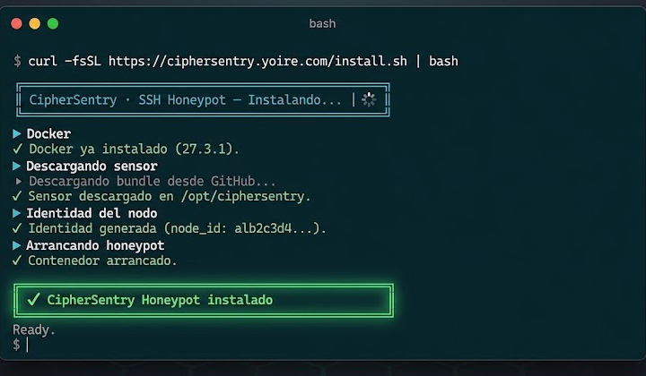
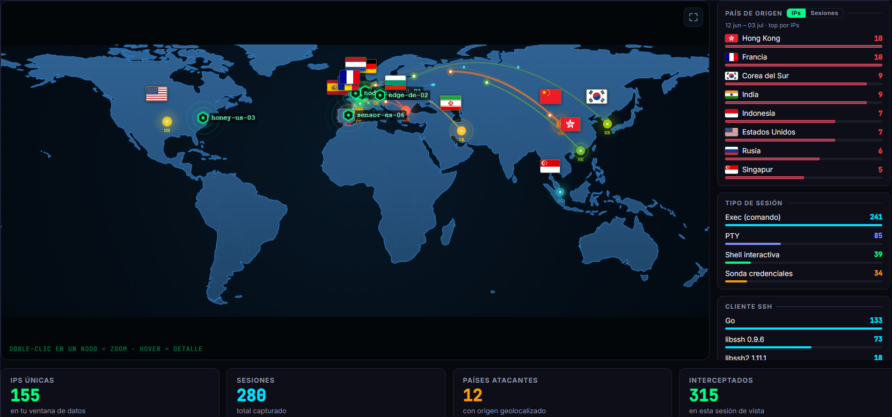

# CipherSentry SSH Honeypot

**English** · [Español](README.es.md)

**Turn every attack into intelligence.**

Open-source SSH honeypot that turns attacker connections into actionable intelligence: it captures credentials, sessions and payloads, and makes them believable by delegating command emulation to the **CipherSentry Shell API**.

> This repository is the client sensor (MIT). The emulation engine (70+ commands, Debian 12 VFS, pipelines, REPLs) lives in the Shell API — it is **not** included here.

---

## The Swarm — distributed sensor network


Install the sensor on any server or VPS with a single command, and deploy as many nodes as you want — a living network of sensors, each beating toward one center. Every node stays visible and manageable from a single dashboard, and intelligence aggregates automatically: the more nodes, the more signal.

---

## Quick deploy



```bash
curl -fsSL https://ciphersentry.yoire.com/install.sh | bash
```

### Installer options

| Option | Description | Default |
|--------|-------------|---------|
| `--key <api_key>` | Link the node to your account from the start | *anonymous mode* |
| `--dir <path>` | Install directory | `/opt/ciphersentry` |
| `--port <num>` | Honeypot SSH port | 22 if free, else 2222 |
| `--no-docker` | Skip Docker install (you already have it) | — |

Common examples:

```bash
# Linked to your account
curl -fsSL https://ciphersentry.yoire.com/install.sh | bash -s -- --key <your-key>

# Docker already installed, custom directory
curl -fsSL https://ciphersentry.yoire.com/install.sh | bash -s -- \
  --dir /opt/ciphersentry \
  --no-docker

# Specific port (e.g. on a host with real SSH on 22)
curl -fsSL https://ciphersentry.yoire.com/install.sh | bash -s -- --port 2222
```

**Works from minute zero:** the sensor ships preconfigured with the CipherSentry Shell API.

**Link the node to your account:**

```bash
bash node.sh enroll     # prints your code (e.g. NODO-A1B2-C3D4-E5F6)
# → The Swarm → Add node → paste the code
```

From then on, all your captures show up in your account.

---

## Node management

From the install directory (`/opt/ciphersentry` by default):

| Command | Action |
|---------|--------|
| `bash node.sh` | Status: port, captured sessions, Shell API reachable |
| `bash node.sh up` | Start the honeypot |
| `bash node.sh down` | Stop the honeypot |
| `bash node.sh logs` | Live activity |
| `bash node.sh enroll` | Code to link this node to your account |
| `bash node.sh test` | Test the connection to the Shell API |
| `bash node.sh update` | Update to the latest version and rebuild |

---

## Updating the sensor

```bash
bash node.sh update
```

Downloads the **latest published version**, rebuilds the container and **keeps your `config.yaml`,
your node identity and your logs**. No manual steps.

> The status printed at the end is drawn by the previous version; **run `bash node.sh` again**
> to see it with the new version.


---

## Dashboard



Manage all your nodes, explore sessions, analyze IPs and export intelligence from a single panel.

---

## Plans

|  | **Free** | **Starter** | **Pro** | **Enterprise** |
|--|----------|-------------|---------|----------------|
| **Price** | Free | €19/mo | €79/mo | €499/mo |
| Session window | 200 | 2,000 | 20,000 | Unlimited / custom |
| Emulated commands / mo | 10,000 | 100,000 | 1,000,000 | Unlimited |
| Swarm nodes | ✓ | ✓ | ✓ | ✓ |
| Data export (GDPR) | ✓ | ✓ | ✓ | ✓ |
| Guided onboarding | — | *coming soon* | *coming soon* | *coming soon* |
| Intelligence: IOCs & reports | — | — | *coming soon* | *coming soon* |
| Campaign detection | — | — | *coming soon* | *coming soon* |
| Extended retention | — | — | *coming soon* | *coming soon* |
| Advanced security / on-prem | — | — | — | *coming soon* |
| Data sovereignty | — | — | — | *coming soon* |

> **Your window** = the last N sessions, always live and rolling. Upgrading widens the window; it never deletes anything.

No credit card to get started · [See all plans →](https://ciphersentry.yoire.com/planes.html)

---

## Configuration

### config.yaml

The node ships **preconfigured** and works from minute zero without touching anything. For most uses you won't need to edit this file — the installer's `--key` and `node.sh enroll` cover the rest.

```yaml
# CipherSentry Honeypot Client — configuration
host: "0.0.0.0"
port: 2222
host_key_file: "host_key"
ssh_banner: "Debian GNU/Linux 12"
ssh_version: "OpenSSH_8.4p1 Debian-5+deb11u1"
accept_any_password: true
fake_hostname: "web-srv-01"
log_dir: "logs"
verbose: false

# Credential-capture window: during [start_minute, end_minute) of each hour, EXEC
# (one-shot commands) are blocked to record credential + command without serving them.
# Interactive SHELL sessions are ALWAYS allowed (they are the gold).
credential_capture:
  enabled: true
  start_minute: 45   # from xx:45
  end_minute: 60     # to xx:00 (60 = on the hour)

# Central Shell API — preconfigured, the node works from minute zero.
# Overridable with SHELL_API_URL (env or .env).
shell_api_url: "https://api.ciphersentry.yoire.com"

# Web panel URL (optional). If omitted, node.sh derives it from api_url.
# dashboard_url: "https://app.ciphersentry.yoire.com"

# Your Swarm API key. Change it to yours so sessions show in your account.
# Find it in: The Swarm → My account → API key.
# Without changing it, sessions are still captured but in anonymous mode.
# Note: "free-demo" is a shared, public key — seeing it here is intentional.
shell_api_key: "free-demo"
```

### Credential-capture window

During `[start_minute, end_minute)` of each hour, the honeypot **blocks non-interactive
commands (EXEC, `ssh host "cmd"`)**: it records the credential and the attempted command
in an `exec_blocked` event, but does **not** run it. This nudges bots to keep trying
credentials. **Interactive SHELL sessions are always allowed on the first try** — they
are the most valuable and are never blocked. Outside the window, EXEC runs normally.

### Environment variables

| Variable | Description | Default |
|----------|-------------|---------|
| `HONEYPOT_PORT` | SSH port | `2222` |
| `SHELL_API_URL` | Shell API URL | `https://api.ciphersentry.yoire.com` |
| `SHELL_API_KEY` | API key for the Shell API | `free-demo` |
| `NODE_ID` | Node identity (per-node granularity in The Swarm) | `node_identity/id` |
| `HONEYPOT_VERBOSE` | Verbose log (`1`/`0`) | `0` |

Environment variables take precedence over `config.yaml`.

**`NODE_ID`** — the node identity sent to the Shell API on every session so activity is
counted **per node** (not just per account). If unset, it is read automatically from
`node_identity/id` (generated by `node.sh`). With Docker, mount `./node_identity`
(already included in `docker-compose.yml`) or pass `NODE_ID` via `.env`.

---

## Shell API

This honeypot requires a **CipherSentry Shell API** instance to work. Without it, it cannot emulate commands.

More info: [ciphersentry.yoire.com](https://ciphersentry.yoire.com/)

---

## Logs

Every event is logged to `logs/sessions.jsonl` in JSON Lines format, compatible with the CipherSentry dashboard. If the node has a `node_id`, **all** events carry it (including pre-session ones like `probe` and `connection`), so the panel can attribute all activity to the node.

Event types: `connection`, `credential_probe`, `probe`, `exec_blocked`, `channel_fingerprint`, `disconnect`, `privilege_escalation`, and the SFTP events: `sftp_session`, `sftp_upload`, `sftp_download`, `sftp_list`, `sftp_delete`.

---

## SFTP

The honeypot implements the **SFTP/SCP** subsystem, so clients in "Files" mode (e.g. Termius)
can connect and browse without errors. Each SFTP session runs in an **isolated temporary
sandbox** (chroot) seeded with a believable Debian 12 tree; nothing touches the host's real
filesystem or other sessions.

**Deletion-proof upload capture.** When an attacker uploads a file, its bytes are copied
**at write time** to a quarantine separate from the sandbox:

```
logs/sftp_uploads/<session_id>/<timestamp>_<uniq>_<name>
```

- The captured file **is kept even if the attacker deletes or renames it** afterwards
  (a dropper that runs and self-deletes is stored all the same).
- **Every version** uploaded is kept, not just the last one.
- Each upload records an `sftp_upload` event with `path`, `size`, `sha256` and the
  quarantine path. Deletions are logged as `sftp_delete` (evidence of track-covering).
- **Nothing uploaded is ever executed** — it is stored as inert data.

The quarantine lives under `logs/` (not committed to git; not exposed over SFTP).

---

## SSH client compatibility

Tested with OpenSSH and mobile clients. Compatibility with **Termius (Android, libssh2)**
required several tweaks to the asyncssh handling. Key points:

- `keyboard-interactive` disabled (asyncssh advertises it by default without a handler).
- `ssh_version` without the `SSH-2.0-` prefix (asyncssh adds it already).
- Client *window-change* requests arrive as a `TerminalSizeChanged` exception on stdin
  and must be ignored, not treated as end of session.

---

## License

MIT — © 2026 CipherSentry
